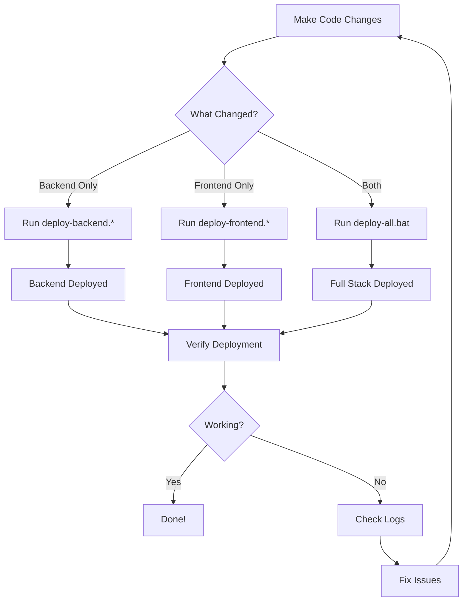

# 🚀 Deployment Scripts

**Official deployment scripts for The Narrow Trail Hiking Portal**

> ⚠️ **IMPORTANT**: These are the ONLY deployment scripts you should use. All other deployment scripts in subdirectories are obsolete and will be removed.

## 📋 Table of Contents

- [Quick Start](#quick-start)
- [Available Scripts](#available-scripts)
- [Prerequisites](#prerequisites)
- [Configuration](#configuration)
- [Safety Features](#safety-features)
- [Troubleshooting](#troubleshooting)

---

## 🎯 Quick Start

### Deploy Everything (Full Stack)
```bash
# Windows CMD
scripts\deploy-all.bat
```

### Deploy Backend Only
```bash
# Windows CMD
scripts\deploy-backend.bat

# Windows PowerShell
scripts\deploy-backend.ps1

# Unix/Linux/Mac
scripts/deploy-backend.sh
```

### Deploy Frontend Only
```bash
# Windows CMD
scripts\deploy-frontend.bat

# Windows PowerShell
scripts\deploy-frontend.ps1

# Unix/Linux/Mac
scripts/deploy-frontend.sh
```

---

## 📜 Available Scripts

### Backend Deployment Scripts

| Script | Platform | Features |
|--------|----------|----------|
| `deploy-backend.bat` | Windows CMD | Full Secret Manager integration, validation |
| `deploy-backend.ps1` | Windows PowerShell | Full Secret Manager integration, colored output |
| `deploy-backend.sh` | Unix/Linux/Mac | Full Secret Manager integration, POSIX compliant |

**All backend scripts include**:
- ✅ Secret Manager secret verification (all 8 secrets)
- ✅ Database configuration (IP: 35.202.149.98)
- ✅ Environment variable configuration
- ✅ Deployment confirmation prompt
- ✅ Windows artifact cleanup
- ✅ Detailed success/failure reporting

### Frontend Deployment Scripts

| Script | Platform | Features |
|--------|----------|----------|
| `deploy-frontend.bat` | Windows CMD | .env.local safety checks, build validation |
| `deploy-frontend.ps1` | Windows PowerShell | .env.local safety checks, colored output |
| `deploy-frontend.sh` | Unix/Linux/Mac | .env.local safety checks, POSIX compliant |

**All frontend scripts include**:
- ✅ .env.local detection and temporary removal
- ✅ .env.production validation
- ✅ Build output scanning (no localhost references)
- ✅ Automatic .env.local restoration
- ✅ Production API URL verification
- ✅ Build cache clearing

### Full-Stack Deployment

| Script | Platform | Description |
|--------|----------|-------------|
| `deploy-all.bat` | Windows CMD | Deploys backend + frontend in sequence |

---

## 🔧 Prerequisites

### Required Tools

1. **Google Cloud SDK** (gcloud)
   - Download: https://cloud.google.com/sdk/docs/install
   - Required for all backend deployments

2. **Firebase CLI**
   - Install: `npm install -g firebase-tools`
   - Required for all frontend deployments

3. **Node.js 18+**
   - Download: https://nodejs.org/
   - Required for all deployments

### Verify Installation

```bash
# Check gcloud
gcloud --version

# Check Firebase CLI
firebase --version

# Check Node.js
node --version
```

---

## ⚙️ Configuration

### Required Configuration Files

#### Backend Configuration
All backend configuration is stored in **Google Cloud Secret Manager**. No local files needed.

#### Frontend Configuration

**Required**: `frontend/.env.production`
```env
REACT_APP_API_URL=https://backend-554106646136.europe-west1.run.app
REACT_APP_ENV=production
```

**Optional**: `frontend/.env.local` (local development only)
```env
REACT_APP_API_URL=http://localhost:3001
REACT_APP_ENV=development
REACT_APP_DEBUG=true
```

> 🔒 **Safety**: `.env.local` is automatically backed up and temporarily removed during production builds to prevent local settings from leaking to production.

### Google Cloud Configuration

**Project Settings**:
- Project ID: `helloliam`
- Project Number: `554106646136`
- Region: `europe-west1`
- Service Name: `backend`

**Database Settings**:
- Host: `35.202.149.98`
- Port: `5432`
- Database: `hiking_portal`
- User: `postgres`
- Password: (from Secret Manager)

### Required Secrets (Secret Manager)

All backend deployments require these 8 secrets to be configured in Google Cloud Secret Manager:

1. `db-password` - PostgreSQL database password
2. `jwt-secret` - JWT token signing secret
3. `sendgrid-key` - SendGrid API key for emails
4. `sendgrid-from-email` - SendGrid sender email address
5. `openweather-api-key` - OpenWeather API key
6. `twilio-sid` - Twilio Account SID
7. `twilio-token` - Twilio Auth Token
8. `twilio-whatsapp-number` - Twilio WhatsApp number

**Scripts will verify all secrets exist before deploying**.

---

## 🛡️ Safety Features

### Frontend Safety Checks

All frontend scripts include these safety features:

1. **Environment File Protection**
   - Detects `.env.local` presence
   - Backs up `.env.local` before build
   - Temporarily removes `.env.local` during build
   - Automatically restores `.env.local` after deployment
   - Ensures production builds use `.env.production` only

2. **Production Validation**
   - Verifies `.env.production` exists
   - Validates correct production API URL
   - Fails if production config is missing or incorrect

3. **Build Output Scanning**
   - Scans all build files for `localhost` references
   - Scans for `127.0.0.1` references
   - Scans for local network addresses (`192.168.x.x`)
   - **Fails deployment** if any local references found

4. **Build Cache Management**
   - Clears build cache before production builds
   - Ensures clean, reproducible builds

### Backend Safety Checks

All backend scripts include these safety features:

1. **Secret Verification**
   - Verifies all 8 required secrets exist in Secret Manager
   - Fails immediately if any secret is missing
   - Lists missing secrets for easy troubleshooting

2. **Windows Artifact Cleanup**
   - Removes `nul` files created by Windows
   - Prevents deployment of Windows-specific artifacts

3. **Deployment Confirmation**
   - Shows what will be deployed
   - Requires explicit user confirmation
   - Prevents accidental deployments

4. **Configuration Validation**
   - Verifies correct database IP
   - Validates all environment variables
   - Checks service account configuration

---

## 🐛 Troubleshooting

### Common Issues

#### Backend Deployment

**Issue**: "Secret not found in Secret Manager"
```
Solution: Create the missing secret in Google Cloud Console
1. Go to https://console.cloud.google.com/security/secret-manager
2. Create the missing secret
3. Grant access to the compute service account
4. Re-run deployment script
```

**Issue**: "Database connection failed"
```
Solution: Verify database IP and Cloud SQL configuration
1. Verify database is running: gcloud sql instances list
2. Check IP address matches: 35.202.149.98
3. Verify Cloud SQL connections enabled in Cloud Run
4. Check firewall rules allow Cloud Run connections
```

**Issue**: "Permission denied"
```
Solution: Verify service account permissions
1. Ensure you're authenticated: gcloud auth list
2. Check project permissions: gcloud projects get-iam-policy helloliam
3. Verify service account has Cloud Run Admin role
```

#### Frontend Deployment

**Issue**: "Build contains localhost references"
```
Solution: .env.local is interfering with production build
1. Ensure .env.local is moved during build (script does this automatically)
2. Check .env.production has correct API URL
3. Clear build cache: rm -rf frontend/node_modules/.cache
4. Re-run deployment script
```

**Issue**: ".env.production not found"
```
Solution: Create production environment file
1. Copy frontend/.env.example to frontend/.env.production
2. Set REACT_APP_API_URL=https://backend-554106646136.europe-west1.run.app
3. Re-run deployment script
```

**Issue**: "Firebase CLI not found"
```
Solution: Install Firebase CLI
npm install -g firebase-tools
firebase login
```

### Verification Steps

After deployment, verify everything is working:

#### Backend Verification
```bash
# Check service is running
gcloud run services describe backend --region europe-west1

# Check logs for errors
gcloud run services logs read backend --region europe-west1 --limit 50

# Test API endpoint
curl https://backend-554106646136.europe-west1.run.app/api/health
```

#### Frontend Verification
```bash
# Check Firebase hosting status
firebase hosting:sites:list

# Visit production site
https://helloliam.web.app
https://www.thenarrowtrail.co.za

# Check browser console for errors
# Verify API calls go to production backend
```

---

## 📊 Deployment Workflow

### Typical Deployment Process



### Best Practices

1. **Test Locally First**
   - Run backend locally with `npm start`
   - Run frontend locally with `npm start`
   - Verify all features work before deploying

2. **Deploy Backend First**
   - If both frontend and backend changed
   - Deploy backend first to ensure API is ready
   - Then deploy frontend to use new backend

3. **Monitor Logs**
   - Check Cloud Run logs after backend deployment
   - Check browser console after frontend deployment
   - Look for errors immediately after deployment

4. **Verify Configuration**
   - Ensure `.env.production` is up to date
   - Verify all Secret Manager secrets exist
   - Check database IP is correct (35.202.149.98)

5. **Use Appropriate Script**
   - Use platform-specific script for your OS
   - Windows users: Use .bat or .ps1
   - Mac/Linux users: Use .sh

---

## 🔗 Related Documentation

- **Backend Documentation**: `backend/README.md`
- **Frontend Documentation**: `frontend/README.md`
- **Deployment Consolidation Plan**: `DEPLOYMENT_CONSOLIDATION_PLAN.md`
- **Deployment Session Summary**: `DEPLOYMENT_SESSION_SUMMARY.md`

---

## 🗑️ Obsolete Scripts (To Be Removed)

The following scripts are **obsolete** and should **NOT** be used:

- ❌ `backend/tools/deploy.sh` - Missing Secret Manager config
- ❌ `backend/tools/deploy.bat` - Missing Secret Manager config
- ❌ `frontend/scripts/deploy-secure.sh` - Replaced by `scripts/deploy-frontend.sh`
- ❌ `frontend/scripts/deploy-secure.ps1` - Replaced by `scripts/deploy-frontend.ps1`
- ❌ `frontend/scripts/deploy-secure-simple.ps1` - Replaced by `scripts/deploy-frontend.ps1`

**These will be removed in a future cleanup.**

---

## ✅ Script Status

| Script | Status | Last Updated | Tested |
|--------|--------|--------------|--------|
| deploy-all.bat | ✅ Ready | 2025-10-13 | ✅ Yes |
| deploy-backend.bat | ✅ Ready | 2025-10-13 | ⚠️ Needs testing |
| deploy-backend.ps1 | ✅ Ready | 2025-10-13 | ✅ Yes |
| deploy-backend.sh | ✅ Ready | 2025-10-13 | ✅ Yes |
| deploy-frontend.bat | ✅ Ready | 2025-10-13 | ⚠️ Needs testing |
| deploy-frontend.ps1 | ✅ Ready | 2025-10-13 | ⚠️ Needs testing |
| deploy-frontend.sh | ✅ Ready | 2025-10-13 | ⚠️ Needs testing |

---

## 🆘 Support

If you encounter issues:

1. Check this README for troubleshooting steps
2. Review script output for specific error messages
3. Check Google Cloud Console for service status
4. Verify all prerequisites are installed
5. Ensure configuration files are correct

---

**Last Updated**: October 13, 2025  
**Maintained By**: Development Team  
**Status**: ✅ Production Ready
